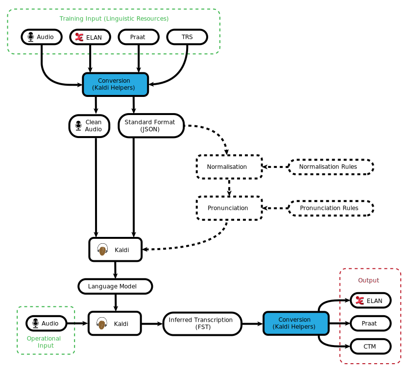

# CoEDL Kaldi pipeline

A set of scripts to use in preparing a corpus for speech-to-text processing with the [Kaldi](http://kaldi-asr.org/) Automatic Speech Recognition Library.

Read about [setting up Docker](https://github.com/CoEDL/elpis/wiki/2018-summer-workshop-preparatio) to run all this.

For more information about data requirements, see the [data guide](https://github.com/CoEDL/elpis/wiki/2018-summer-workshop-preparation).

## Requirements
This pipeline relies on Python 3.6 and several open-source Python packages (listed [here](./requirements.txt)).
It also assumes you have Kaldi, sox and [task](https://taskfile.org/) installed. We highly recommend using 
[our docker image](https://github.com/CoEDL/elpis/wiki/2018-summer-workshop-preparation).

## Tasks
This library uses the [task](https://taskfile.org) tool to run the more complex processes automatically. Once 
you've set up kadi_helpers, you can run the various pipeline tasks we've developed. You can read about these [here](docs/guides/about-the-tasks.md). 

## Workflow

  

